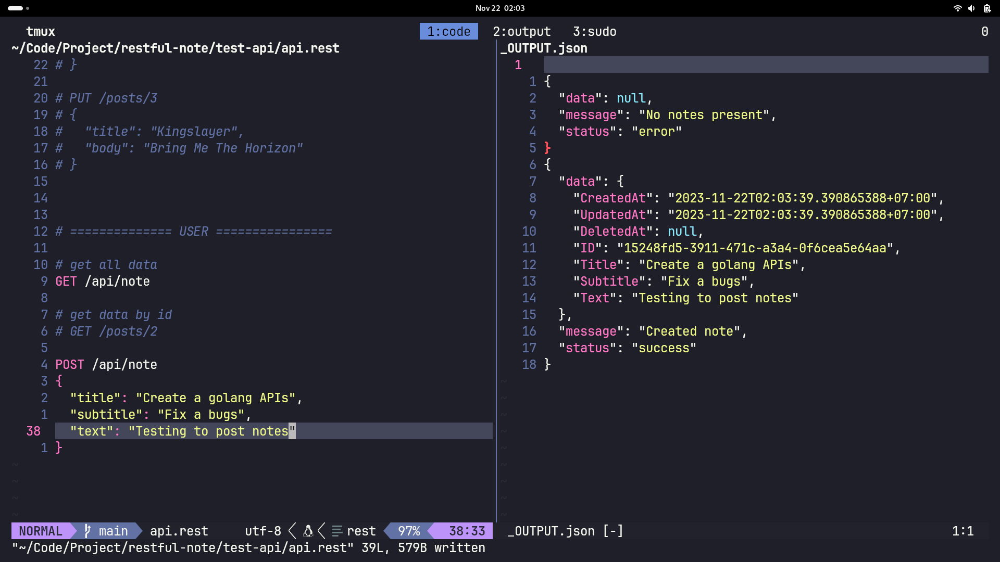

## Run this project using: air

# RESTful Notes Taking APIs

> A Rest APIs for Note taking with fully functionality backend services.
> Implemented Fiber Framework to build Rest APIs.

## Table of Contents

- [Requirements](#requirements)
- [Features](#features)
- [Screenshots](#screenshots)
- [Setup](#setup)
- [Endpoint](#endpoint)
- [Project Status](#project-status)
- [Room for Improvement](#room-for-improvement)
- [Contact](#contact)

## Requirements

- Go Installed    	  - version 1.21.4
- PostgreSQL 		  - version 15.4.0
- Fiber framework 	  - v2
- Air for live reload - version 1.49.0
- Prefarrably Linux Machine

## Features

- Perform CRUD operation to PostgreSQL database using Gorm ORM.
- Save, FindAll, FindByID, Update and Delete a Note.
- Implementation of backend features in Fiber framework.

## Screenshots



## Setup

To run this project, build it using docker-compose:

```bash
$ cd ../restful-note
$ go mod tidy # to install all package/module
$ air
```

## Endpoint

- Get All Note endpoint -> /api/note
- Get Note By ID endpoint -> /api/note/:noteId
- Create Note endpoint -> /api/note
- Update Note By ID endpoint -> /api/note/:noteId
- Delete Note By ID endpoint -> /api/note/:noteId

Open [http://localhost:3000/api/note](http://localhost:3000/api/note) with your browser to see all data.

## Project Status

Project is: _complete._ <!-- / _complete_ / _no longer being worked on_. reason ? -->

## Room for Improvement

- Adding user to note posts.
- Rest APIs of related note taking.

## Contact

Created by [@Zulhaditya](https://zulhaditya.vercel.app/) - feel free to contact me!
